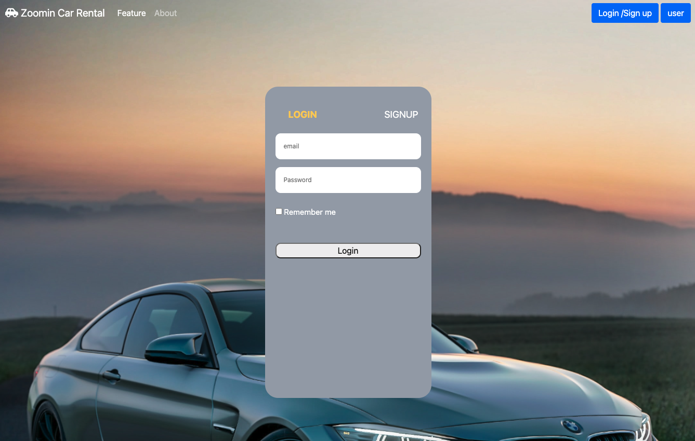
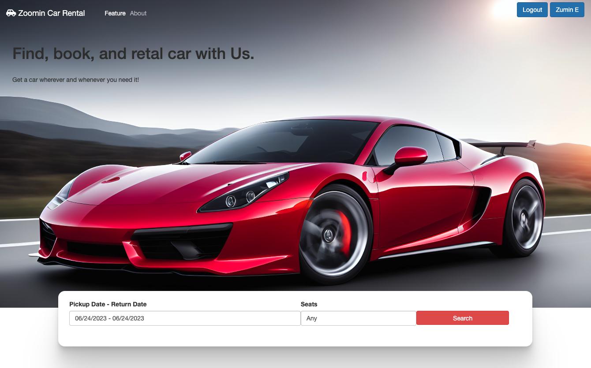
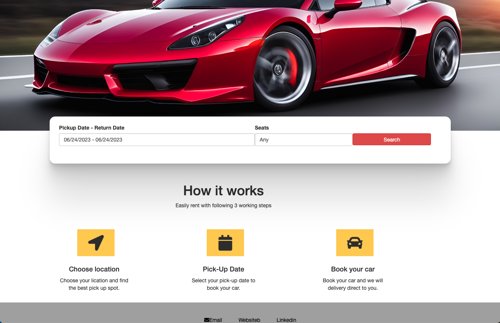
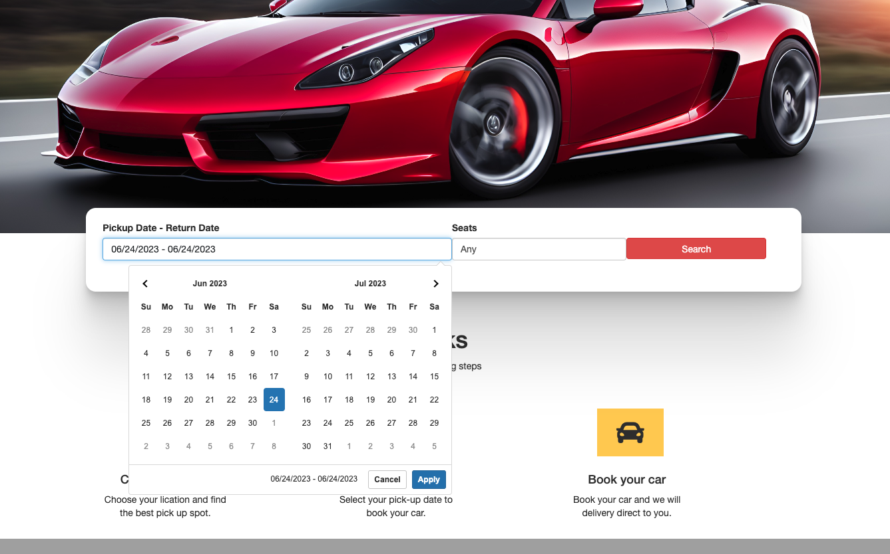
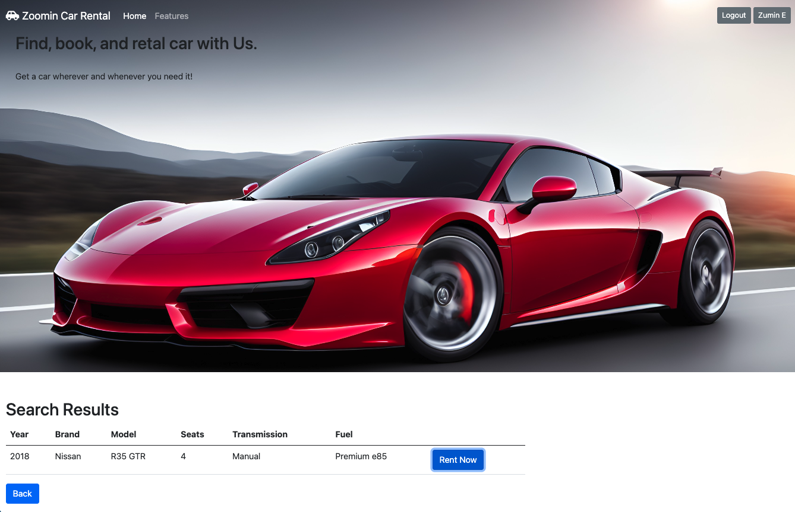
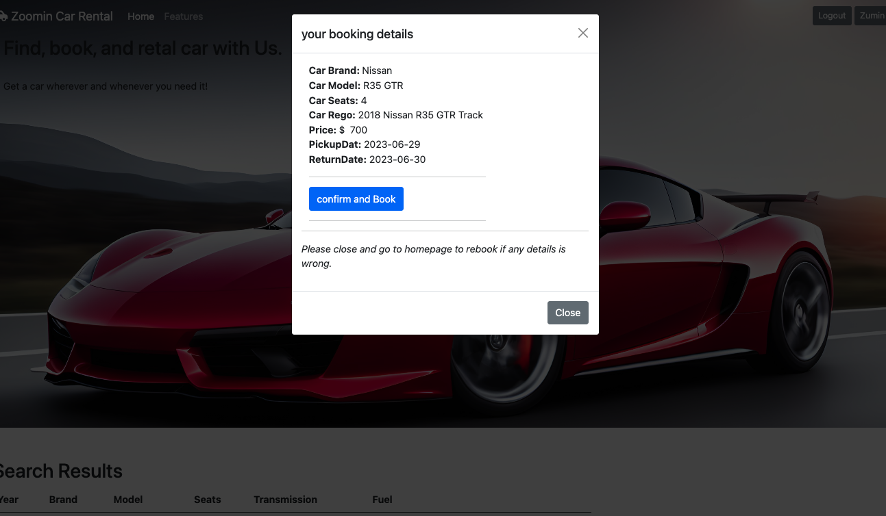
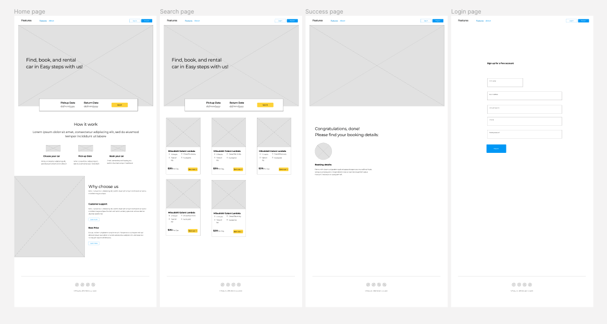
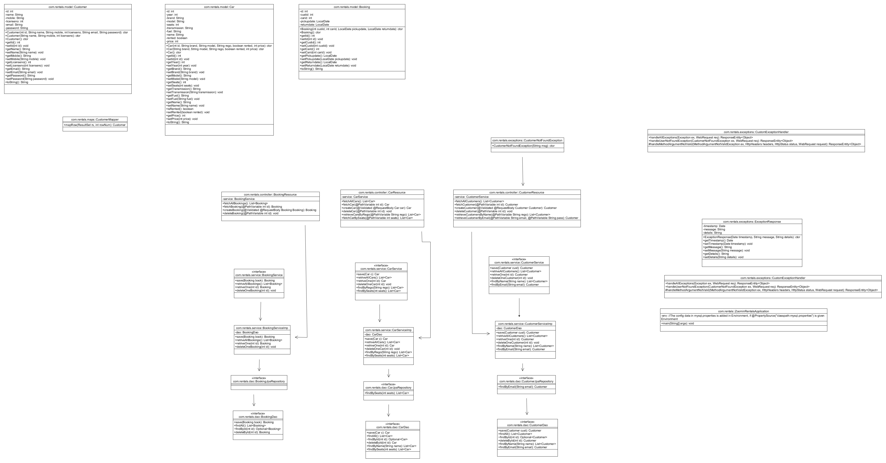

# Zoomin-Rentals-Application
##### JavaRestful Web Service Application (Spring boot)

MASTER BRANCH: Java backend code
MAIN BRANCH: Front end code

#### User Manual Sections

1. ##### Account Creation

   - To access the car rental services, you need to create an account.

   - Click on the "Sign Up" or "Create Account" button on the homepage.

   -  Fill in the required information, including your name, email address, password, and any other requested .

   -  Click on the "Create Account" button to complete the registration process.

     ​

2. ##### Logging In

   - To log in to your account, click on the "Log In" or "Sign In" button on the homepage.

   - Enter your registered email address and password in the provided fields.

   - Click on the "Log In" button to access your account.

     ​

3. ##### Browsing and Searching for Rental Cars

   - After logging in, you will be directed to the car rental homepage.

   - Browse through the available car options or use the search feature to find specific cars based on location, dates, or other preferences.

   - Use the filters or sorting options to refine your search results.

   - Click on a car listing to view more details, such as car specifications, rental rates, availability, and any additional features.

     ​

4. ##### Making a Car Rental Booking

   -  Once you have found the desired car, select the rental dates and times.

   - Review the rental information.

   - Click on the "Book Now" button.

   - Confirm your booking details and proceed to Rent.

     ​

5. ##### Managing Your Bookings

   - To view your current and past car rental bookings, go to your account dashboard.

   - You will find a section dedicated to your bookings, displaying the relevant information.

   - From here, you can review details, continuel bookings, if need to modify booking, will need to go back to search page.

     ​

6. ##### Updating Profile Information

   - To update your profile information, click on the "Profile" or "Account Settings" option in your account menu.
   - Edit the desired fields, such as your name, contact details, or password.
   -  Save the changes to update your profile information.

 

Note: This user manual provides a general overview of the car rental website's features and functionality. For specific instructions or any additional assistance, please refer to the website's help section or contact customer support.

#### Sceenshot for website:

- ##### Log-in and Sign up page

- ##### Home page

- ##### Home page with date range picker

- ##### Search-result page

- ##### Confirm booking page in Modal 

#### Wireframes

#### UML 

#### Tech Stack:

**Front-end**: HTML5, CSS3, Bootstrap, Javascript, AJAX and JQuery.

**Back-end**: Java, spring boot

**Database**: MySQL

**Testing**: Junit

**Project-management tools**: Trello, Discord

**Utilities**: Draw.io, Figma, Lucid-chart

**DevOps**: Git, Github, VS Code